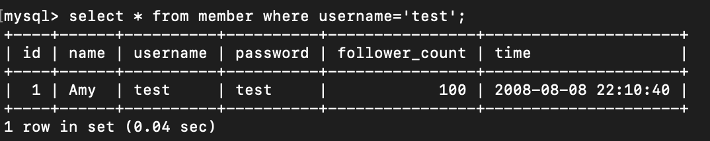

# Assignment - Week 5

## Install

This project uses MySQL. Go check them out if you don't have them locally installed.

`https://www.mysql.com/`

## Content

### Task 3

<ol>
    <li>


```
insert into member(id, name, username, password, follower_count, time)values (1, 'Amy', 'test', 'test', 100, '2008-08-08 22:10:40');
insert into member(id, name, username, password, follower_count, time)values (2, 'Ben', 'aaa', 'aaa', 150, '2011-02-11 11:18:20');
insert into member(id, name, username, password, follower_count, time)values (3, 'Charlie', 'bbb', 'bbb', 20, '2003-12-01 03:55:50');
insert into member(id, name, username, password, follower_count, time)values (4, 'Doris', 'ccc', 'ccc', 450, '2020-01-01 15:35:10');
insert into member(id, name, username, password, follower_count, time)values (5, 'Eric', 'ddd', 'ddd', 80, '2009-03-03 09:30:00');
```


<li>

```select * from member;```


<li>

```select * from member order by time desc;```


<li>

```select * from member order by time desc limit 1,3;```


<li>

```select * from member where username='test';```



<li>

 ```select * from member where username='test' and password='test';```


<li>

```update member set name='test2' where username='test';```


</ol>

### Task 4

<ol>
    <li>


```select count(*) from member;```


<li>

```select sum(follower_count) from member;```


<li>

```select avg(follower_count) from member;```


</ol>

### Task 5

<ol>
<li>

```
CREATE TABLE message(
    id bigint primary key auto_increment, 
    member_id bigint not null, 
    content varchar(255) not null, 
    like_count int unsigned not null default 0,
    time datetime not null default current_timestamp
    );
```


<li>

```
select member.name, message.content from member inner join message on member.id=message.member_id;
```


<li>

```
select member.name, message.content from member inner join message on member.id=message.member_id where user name='test';
```


<li>

```
select avg(like_count) from member inner join message on member.id=message.member_id where username='test';
```


